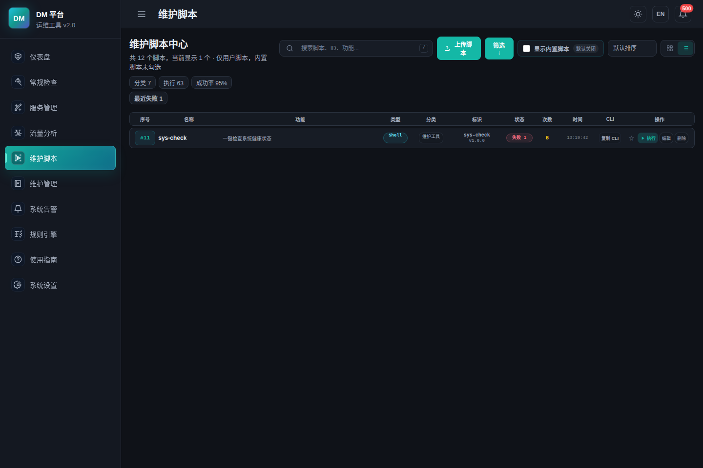

# DM 现场维护工具

DM 是一个面向现场维护、故障定位和离线部署的 Linux 运维控制台。它把系统体检、维护脚本、服务管理、流量分析、告警规则、维护文档和 CLI 收敛到一个静态二进制里，适合内网、离线环境、多架构服务器和应急排障场景。

```text
现场先看状态 -> 定位证据 -> 执行脚本 -> 留存记录 -> 导出交付
```

## 界面预览





## 核心能力

| 模块 | 能力 |
| --- | --- |
| 仪表盘 | 系统概要、资源趋势、Top 进程、健康入口、运行态概览 |
| 系统体检 | 一键体检、检查日志、结果详情、告警去重、连接配置导入导出 |
| 维护脚本 | 用户脚本上传、编辑、重新传入文件、参数表单、执行历史、CLI 复制 |
| 服务管理 | 进程、systemd unit、端口、CPU、内存、日志、健康检查、启动/停止/重启 |
| 流量分析 | TCP/UDP/HTTP 明文解析、PCAP 导入、PCAP 导出、请求详情、JSON/XML 美化 |
| 系统告警 | 告警聚合、规则命中、详情查看、处理建议、历史追踪 |
| 维护文档 | 文档上传、维护记录、自动解析、闭环留痕 |
| CLI | 与 Web 共用脚本、检查、配置和导出能力 |
| 打包 | x86_64 和 ARM64 Linux musl 静态包，适合现场分发 |

## 快速开始

下载对应架构的 zip 包：

```bash
unzip dm-x86_64-unknown-linux-musl.zip
cd dm-x86_64-unknown-linux-musl
sudo bash install.sh
```

启动 Web 控制台：

```bash
dm serve --bind 0.0.0.0 --port 3399
```

后台启动：

```bash
dm serve -d --bind 0.0.0.0 --port 3399
```

后台模式会把 PID 和日志写入用户日志目录：

```text
~/.dm/logs/dm-serve-3399.pid
~/.dm/logs/dm-serve-3399.log
```

停止后台服务：

```bash
kill "$(cat ~/.dm/logs/dm-serve-3399.pid)"
```

访问：

```text
http://服务器IP:3399
```

常用 CLI：

```bash
dm list
dm run security
dm check system
dm check redis
dm check-config template -o dm-check-config-template.json
dm check-config import dm-check-config-template.json
```

## 维护脚本中心

维护脚本是 DM 的核心功能。用户脚本默认独立展示，内置脚本需要手动勾选后才会一起显示。

支持的脚本类型：

```text
sh, bash, zsh, ksh, py, python, pl, perl, js, mjs, rb, lua, php, awk, expect, run, bin
```

脚本可以通过 Web 上传，也可以放入用户脚本目录：

```text
~/.dm/scripts/
└── restart-nginx/
    ├── restart-nginx.sh
    └── .dm.toml
```

`.dm.toml` 示例：

```toml
name = "restart-nginx"
description = "重启 Nginx 并检查端口"
feature = "服务重启、端口确认、日志提示"
example = "dm run restart-nginx"
version = "1.0.0"
author = "ops"
category = "服务管理"
```

编辑用户脚本时可以：

- 修改名称、分类、作者、版本、功能摘要和描述。
- 直接编辑脚本内容。
- 重新传入新的脚本文件，文件扩展名会刷新脚本类型。
- 配置执行参数，详情页会自动生成参数表单。
- 固定复制 CLI 命令，例如 `dm run restart-nginx`。

## 连接配置

系统设置和常规检查共用同一份连接配置。支持模板导出和 JSON 导入。

```bash
dm check-config template -o dm-check-config-template.json
dm check-config import dm-check-config-template.json
```

示例：

```json
{
  "version": 1,
  "configs": {
    "redis": {
      "host": "127.0.0.1",
      "port": "6379",
      "password": ""
    },
    "mysql": {
      "host": "127.0.0.1",
      "port": "3306",
      "username": "root",
      "password": ""
    },
    "elasticsearch": {
      "url": "http://127.0.0.1:9200",
      "username": "",
      "password": ""
    }
  }
}
```

## 流量分析边界

DM 会尽量显示原始明文：

| 流量类型 | 显示方式 |
| --- | --- |
| HTTP | 方法、路径、Host、Header、Body、状态码 |
| TCP/UDP 明文 | 原始可读 payload |
| JSON/XML | 智能格式化、自动换行 |
| PCAP | 支持导入分析和导出原始 pcap |
| HTTPS/TLS | 显示 SNI、TLS 状态、HEX、ASCII |

HTTPS 的网络原包通常是 TLS 密文。没有 TLS session keys、SSLKEYLOGFILE 或受信任解密代理时，抓包文件里不存在 HTTP 明文请求方法和正文，DM 不会把密文伪装成明文。

## 本地构建

`package.sh` 默认使用自动模式：

- 在本地执行时，如果检测到 `offline/npm-cache` 和 `offline/cargo/vendor`，优先使用项目内离线依赖。
- 如果本地没有完整 offline 依赖，则联网下载依赖。
- 在 GitHub Actions 中默认联网下载依赖，不要求提交 500MB 的 offline 缓存。

只构建 x86_64：

```bash
PACKAGE_TARGETS="x86_64-unknown-linux-musl" ./package.sh
```

构建 x86_64 和 ARM64：

```bash
PACKAGE_TARGETS="x86_64-unknown-linux-musl aarch64-unknown-linux-musl" ./package.sh
```

强制离线构建：

```bash
USE_OFFLINE_DEPS=1 PACKAGE_TARGETS="x86_64-unknown-linux-musl aarch64-unknown-linux-musl" ./package.sh
```

强制联网构建：

```bash
USE_OFFLINE_DEPS=0 PACKAGE_TARGETS="x86_64-unknown-linux-musl aarch64-unknown-linux-musl" ./package.sh
```

输出：

```text
target/packages/dm-x86_64-unknown-linux-musl.zip
target/packages/dm-aarch64-unknown-linux-musl.zip
```

## GitHub Actions

提交到 GitHub 后会自动触发普通构建：

```text
.github/workflows/build.yml
```

行为：

- push 任意分支自动构建。
- 自动下载 npm 和 Cargo 依赖。
- 执行 `cargo fmt --check`。
- 执行 `cargo test --locked`。
- 构建 x86_64 和 ARM64 Linux musl 包。
- 上传 zip 到 GitHub Actions artifacts。

推送 `v*` tag 会触发 Release 构建：

```bash
git tag v0.1.0
git push origin v0.1.0
```

Release workflow 会构建多架构包并发布 GitHub Release。

## 目录

| 路径 | 内容 |
| --- | --- |
| `src/` | Rust 后端、CLI、检查逻辑 |
| `web/` | Svelte Web 控制台 |
| `scripts/` | 内置维护脚本 |
| `offline/` | 可选离线依赖缓存 |
| `target/packages/` | 打包产物 |
| `docs/images/` | README 截图 |

## 部署路径

| 内容 | 默认路径 |
| --- | --- |
| 二进制 | `/usr/bin/dm` |
| 用户脚本 | `~/.dm/scripts/` |
| 数据目录 | `~/.dm/data/` |
| 日志目录 | `~/.dm/logs/` |
| 配置文件 | `~/.dm/.dm.toml` |

## 许可证

MIT
